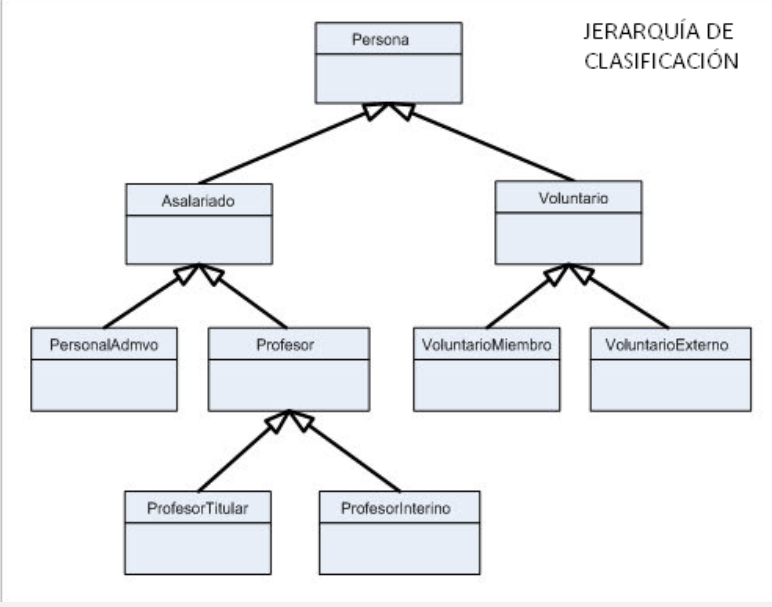

# 🛠️ Implementar clases que posean
- herencia
- abstraccion
- polimorfismo.

## 🧠 Planteamiento del problema
Replicar el ejercicio persona que vimos en clase, creando ahora las clases de la imagen con las siguientes condiciones:

### 🔴 Pasos a tener en cuenta
1. Solo se pueden instancias las clases finales (clases que no extienden a más clases).

2. La clase Persona debe tener un metodo que solo implementen sus hijas, no puede llamarse desde el main().

3. Asalariado y voluntario deben tener un metodo abstracto que se pueda llamar desde cualquier otra clase (main()).

